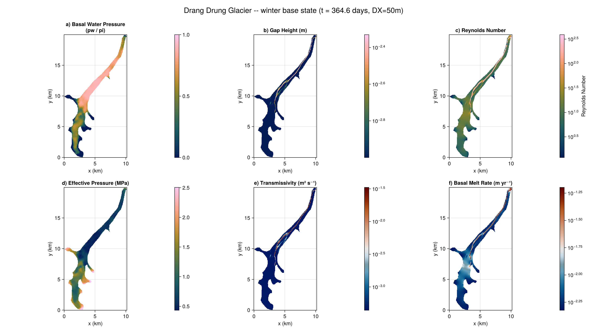

# [Drang Drung Glacier](@id DrangDrung)

Applies Shakti to real data: the winter subglacial hydrology of Drang Drung Glacier, Zanskar
Valley, Ladakh (western Himalaya), from Thota, Vijay, Sommers, Banerjee, Mey and Motagh (2026),
[doi:10.1017/jog.2026.10150](https://doi.org/10.1017/jog.2026.10150) (data:
[10.5281/zenodo.17593643](https://doi.org/10.5281/zenodo.17593643)). Unlike
[Helheim Glacier](@ref Helheim)'s large outlet glacier, this is a small alpine/mountain glacier --
the same native ISSM/SHAKTI unstructured-mesh pipeline applies (2408 vertices, 4300 elements, a
much smaller mesh than Helheim's 6371/12472), rasterized here at `DX=50m` with `dt=1800s`
(30 minutes).

This page shows the same steps as [Helheim Glacier](@ref Helheim) but does not re-run the
simulation at doc-build time: a full year (17520 steps) at this resolution takes about 37 minutes.
The code below is illustrative; the figure at the bottom is from a real run.

## Loading the raw mesh

Same MATLAB-classdef-via-`MAT.jl` structure as Helheim's `.mat` file.

```julia
using Shakti, MAT

d = matread(joinpath(DATADIR, "DD_SHAKTI_winter_1yr.mat"))
md = d["md"].d

mesh_s = md["mesh"].d
xs, ys = vec(mesh_s["x"]), vec(mesh_s["y"])
elements = Int.(mesh_s["elements"])
Nv, Ntri = Int(mesh_s["numberofvertices"]), Int(mesh_s["numberofelements"]) # 2408, 4300

bed       = vec(md["geometry"].d["bed"])
thickness = vec(md["geometry"].d["thickness"])
G_in      = vec(md["basalforcings"].d["geothermalflux"])
friction  = vec(md["friction"].d["coefficient"]) # uniformly 500.0
B_visc    = vec(md["materials"].d["rheology_B"])  # 0C "temperate ice", Cuffey -- softer than Helheim's
A_visc_vertex = B_visc .^ (-3.0) # Glen's law: A = B^(-n)
```

## Rasterizing onto a regular grid

Identical barycentric-interpolation approach to Helheim's, at `DX=50m`.

```julia
const DX = 50.0
# ... same per-triangle bounding-box walk + barycentric weights as Helheim.jl
```

## The terminus: a proglacial-lake boundary

Drang Drung's terminus condition is a Dirichlet head offset representing a 3.0m-deep proglacial
lake (Ramsankaran and others 2023).

## Building the state

[`LinearSlidingLaw`](@ref) again (`taub = C^2*N*u_b`), here with a spatially uniform `C=500` --
this dataset has zero sliding velocity and zero external meltwater input, so the run is a pure
geothermal+frictional-melt spin-up, the same role Helheim's winter base state plays.

```julia
p = ModelParameters(rho_i = 917.0, rho_w = 1000.0, nu = 1.787e-6, n = 3.0,
                     omega = 1e-3, br = 0.0, lr = 1.0, ct = 0.0, cw = 4.22e3,
                     b_min = 1e-3, b_max = 1.0)
mi = ConstantMeltInput()
sl = LinearSlidingLaw(grid, fill(500.0, Nx, Ny))

state = State(grid)
set_initial_conditions!(state, grid, p, sl, mask, A_visc, zb, zs, gap, G, ub_x, ub_y, ieb, taub_x, taub_y)
```

## Running to the winter base state

`dt=1800s`, `tsteps=17520` (365 days).

```julia
ls = CholeskyDirectSolver(grid)
ps = PicardSolver(500, 1e-6, ls, grid)

sim = Simulation(grid, state, 17520, 1800.0, p, "implicit",
                 ["h", "pw", "po", "b", "N", "mdot", "Re", "K"], mi, sl;
                 ps = ps, which_observer = "IO", which_file_writer = "NetCDF",
                 path = "drangdrung_winter.nc")
run!(sim)
```

## Results

Final state (t=364.6 days): (a) water pressure as a fraction of overburden, (b) gap height, (c)
Reynolds number, (d) effective pressure, (e) transmissivity, (f) basal melt rate. A single
channelized drainage path is visible, running from the tributary confluence down the main trunk to
the terminus -- the same qualitative pattern shown in the paper's supplementary Figure S5 ("Winter
effective pressure and subglacial water flux simulated in SHAKTI-ISSM").


